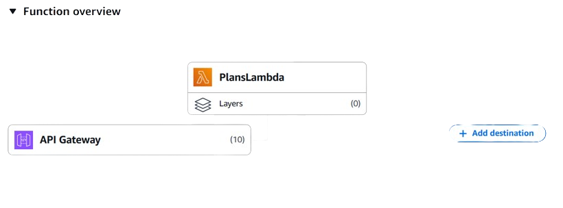

# plan.obs


[](https://github.com/OneBitShiftLogics/plan.obs/actions/workflows/deploy-cdk.yml)


## Description


This repository is dedicated to building a high-quality project for our customers. It serves as a collaborative space where contributors work together to develop and enhance the system while following best practices. Our goal is to maintain clean, efficient code and ensure seamless functionality.

## Table of Contents
- [plan.obs](#planobs)
  - [Description](#description)
  - [Table of Contents](#table-of-contents)
  - [Installation](#installation)
  - [Usage](#usage)
  - [Configuration](#configuration)
  - [Development](#development)

## Installation
* #### Clone the repository
  ```bash
  git clone https://github.com/your-repo.git
  ```
* #### Navigate to the project directory
  ```bash
  cd your-repo
  ```

* #### Install dependencies
  ```bash
  npm install  
  ``` 
  or
  ```bash
  pip install -r requirements.txt
  ```

## Usage
```bash
# Start the project
npm start  # or python main.py (if using Python)

# Access the application
http://localhost:3000  # Adjust the port as needed
```

## Configuration
Ensure all required environment variables are set up before running the project. Configuration files can be found in the `config/` directory. Modify them as needed.

## Development
- Follow the branching strategy for feature development.
- Ensure code quality with proper formatting and linting.
- Run tests before submitting changes.
- Use pull requests for code review and approval.


